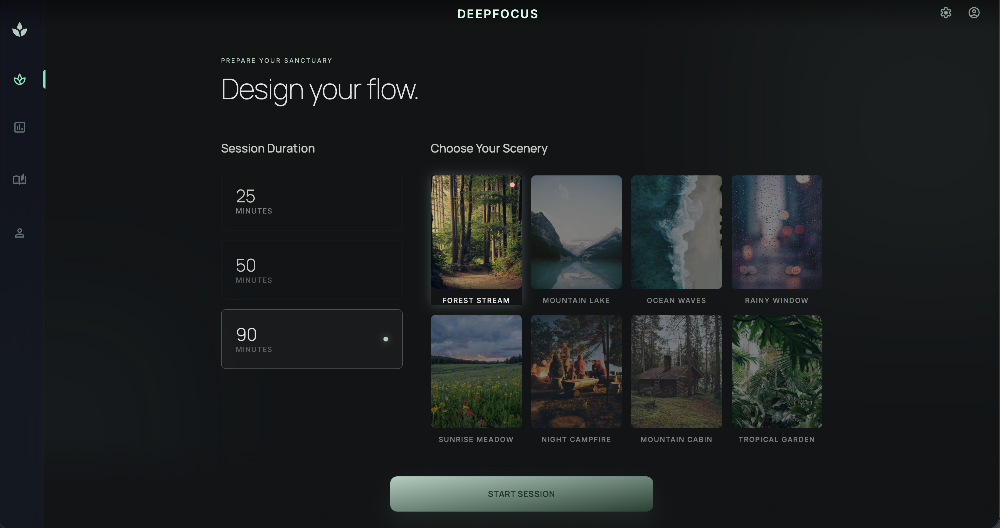
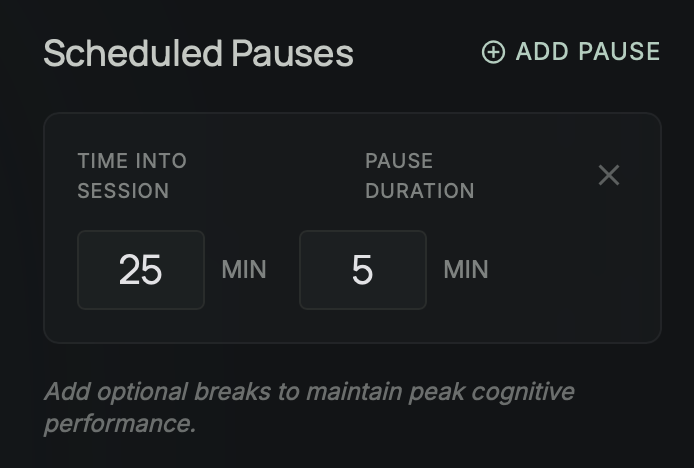
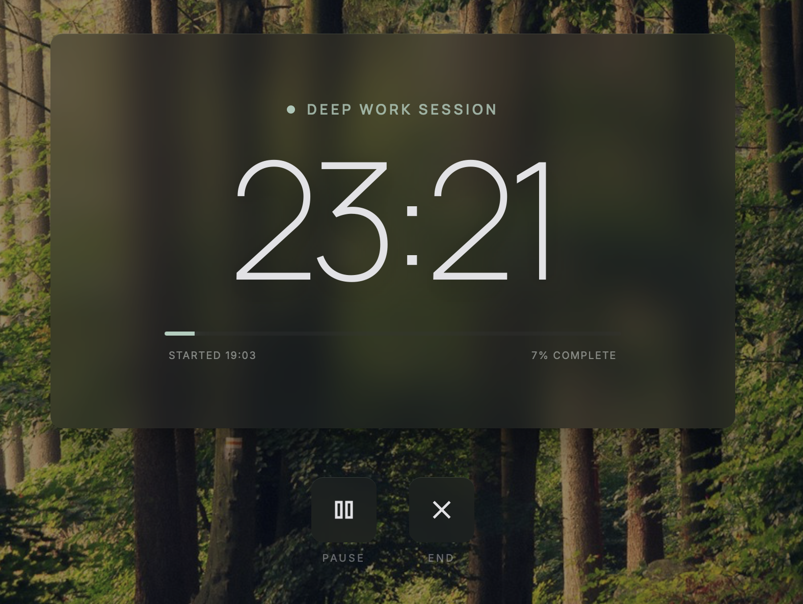
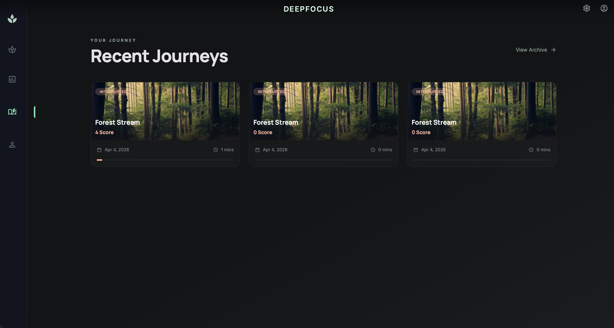

# DeepFocus - Immersive Study Environment

[](https://L0nkC.github.io/DeepFocus---Immersive-Study-Environment/)

A Progressive Web App (PWA) that tracks true focus by detecting tab switching, window focus loss, and idle time. Transform your study sessions into immersive experiences with nature scenery and ambient sounds.

## Screenshots

### Setup Screen - Design Your Flow
Choose your scenery, set custom session duration (5-120 minutes), and schedule breaks.



### Scheduled Pauses - Maintain Peak Performance
Add optional breaks by setting "Time Into Session" and "Pause Duration" in minutes. The input boxes make it easy to configure when breaks happen.



### Focus Session - Deep Work Mode
Immersive fullscreen timer with nature background and ambient audio.


### Pause Markers on Timeline
Visual indicators on the progress bar show when scheduled breaks will occur.



### Session History - Track Your Journey
View your "Recent Journeys" with session cards showing scenery, scores, dates, and duration. Access via the book icon in the sidebar.



## Features

### Core Functionality
- **Always-Visible Timer** - Fullscreen focus mode with large, elegant timer display
- **8 Nature Sceneries** - Forest Stream, Mountain Lake, Ocean Waves, Rainy Window, Sunrise Meadow, Night Campfire, Mountain Cabin, Tropical Garden
- **Custom Duration** - Slider to set any session length from 5 to 120 minutes
- **Scheduled Pauses** - Set automatic breaks at specific times with countdown timer
- **Volume Control** - Slider to adjust ambient sound volume
- **Focus Integrity Score** - Tracks your focus quality by detecting interruptions
- **Smart Analytics** - Real session data with streaks, focus time, and session history

### Focus Detection
- **Tab Switching Detection** - Automatically pauses timer when you leave the tab
- **Window Focus Tracking** - Monitors when you switch to other applications
- **Interruption Counter** - Tracks how many times you leave during a session
- **Auto-Pause/Resume** - Timer pauses immediately when interrupted, resumes when you return

### Scheduled Breaks System
- **Custom Break Times** - Schedule pauses at specific minutes into your session
- **Break Duration** - Set how long each break lasts (1-30 minutes)
- **Visual Timeline Markers** - See break times marked on the session progress bar
- **Auto-Resuming Break Timer** - Separate countdown during breaks that auto-resumes focus session
- **Break Notifications** - Toast notifications when breaks start and end

### Analytics Dashboard
- **Total Focus Time** - Cumulative time spent in focus
- **Current Streak** - Consecutive days with focus sessions
- **Focus Integrity** - Percentage of time actually focused vs session time
- **Session History** - View all past sessions with scenery, scores, and dates
- **Session Insights** - Average duration, interruptions per session

## Tech Stack

- **HTML5** - Semantic markup
- **Tailwind CSS** - Utility-first styling via CDN
- **Vanilla JavaScript** - No frameworks, pure ES6+
- **LocalStorage** - Data persistence
- **Material Symbols** - Google Icons

## Getting Started

### 🌐 Live Website
**Access the app directly at: https://L0nkC.github.io/DeepFocus---Immersive-Study-Environment/**

Or open `index.html` directly in your browser.

## Session Flow

1. **Setup** - Choose scenery, set duration with slider, add scheduled pauses
2. **Focus Mode** - Fullscreen timer with nature background and ambient audio
3. **Break Time** - Auto-pause at scheduled times with countdown timer
4. **Auto-Resume** - Focus session continues automatically after break ends
5. **Analytics** - View detailed stats and session history after completion

## How Focus Detection Works

The app uses multiple detection methods:

```javascript
// Tab visibility API - pauses when you switch tabs
document.addEventListener('visibilitychange', () => {
  if (document.hidden) {
    state.interruptions++;
    pauseTimer();
  }
});

// Window focus/blur - pauses when you leave the window
window.addEventListener('blur', () => pauseTimer());
```

## How Scheduled Breaks Work

1. **Set Breaks in Setup** - Add pauses with "Time Into Session" and "Duration"
2. **Visual Markers** - Break times appear as orange lines on the progress bar
3. **Auto-Trigger** - Timer pauses automatically when break time is reached
4. **Break Countdown** - Separate timer counts down the break duration
5. **Auto-Resume** - Focus session resumes automatically when break ends

## Design System

### Colors
- **Background**: Dark slate (#121416)
- **Primary**: Sage green (#aecebe)
- **Tertiary**: Soft coral (#ffb59e) - for interruptions and breaks
- **Surface**: Dark panels with glass-morphism effect

### Typography
- **Headlines**: Manrope font
- **Body**: Inter font
- **Timer**: Large, thin weight for elegance

## File Structure

```
├── index.html              # Main app (single file)
├── screenshots/            # App screenshots
│   ├── setup-screen.png
│   ├── scheduled-pauses.png
│   ├── focus-session.png
│   ├── pause-markers.png
│   └── session-history.png
└── README.md
```

## Browser Compatibility

- Chrome 90+
- Firefox 88+
- Safari 14+
- Edge 90+

**Note**: Audio requires user interaction due to browser autoplay policies.

## License

MIT License

---

Made with focus 🌿
